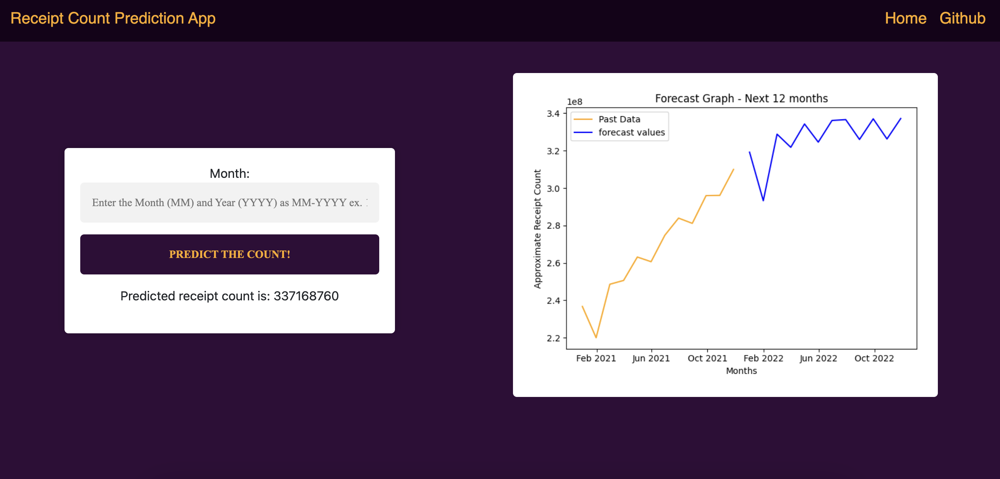

# Receipt-count-prediction-using-flask
In this project, I worked on developing a predictive/forecast model for approximate reciept counts per month. It deploys as a flask APP with an HTML frontend and uses a simple LSTM network to predict the future values. The project starts from data analysis performed in a ipython notebook and ends as a complete web application that shows the visual for future monthly values and allows its users to forecast values for random future months as well.

## Getting Started

#### Using Docker

```
docker build -t receipt-pred-app .

// To run app on port 3000
docker run -p 3000:3000 receipt-pred-app
```

#### Local Setup
To run the web app on your local computer, install the required libraries. These packages are include in the requirement.txt file. This project used Python 3.8.18 and Flask 3.0.0.<br><br> Run the following command in the terminal to install the required packages.<br><br>

```
pip install -r requirement.txt

// To run app on port 3000
gunicorn --bind :3000 --workers 1 --threads 8 --timeout 0 app:app
```

<br>

## Preview


<br>
<br>

## Discussion

The project started with an initial data analysis task aimed at uncovering predictive indicators, relevant features, and emerging trends within the dataset. It became evident that the dataset possessed inherent predictive structures.

In response to this challenge, I worked on the design and implementation of a straightforward Long Short-Term Memory (LSTM) network using the Keras framework for training given the requirement of utilizing advanced learning techniques beyond conventional sci-kit-learn-based algorithms. An alternative approach to this would be the application of regression and classical time series-based algorithms like ARIMA as the analysis resulted in the identification of linear trends and seasonality within the data.

The data used for model training was processed, transforming it into a series of time-based data points, each with a fixed length of n_steps=120. Extensive experimentation revealed that this particular value yielded the most promising results among its variations. Subsequently, the dataset was scaled utilizing the min-max scaling technique, and the predicted values were reconstructed by reversing this scaling process.

Notably, this project focused on single-step prediction as the latency requirements were not overly demanding, thus I worked on prioritizing prediction accuracy.


**NOTE**:

- Overall the prediction of february shows a dip as the number of days in the month are less than other months.
- It's important to mention that both the dataset and the model have been shared on the GitHub repository for project documentation purposes, while in practical applications, these assets would typically be stored in secure repositories.


### Thank you

